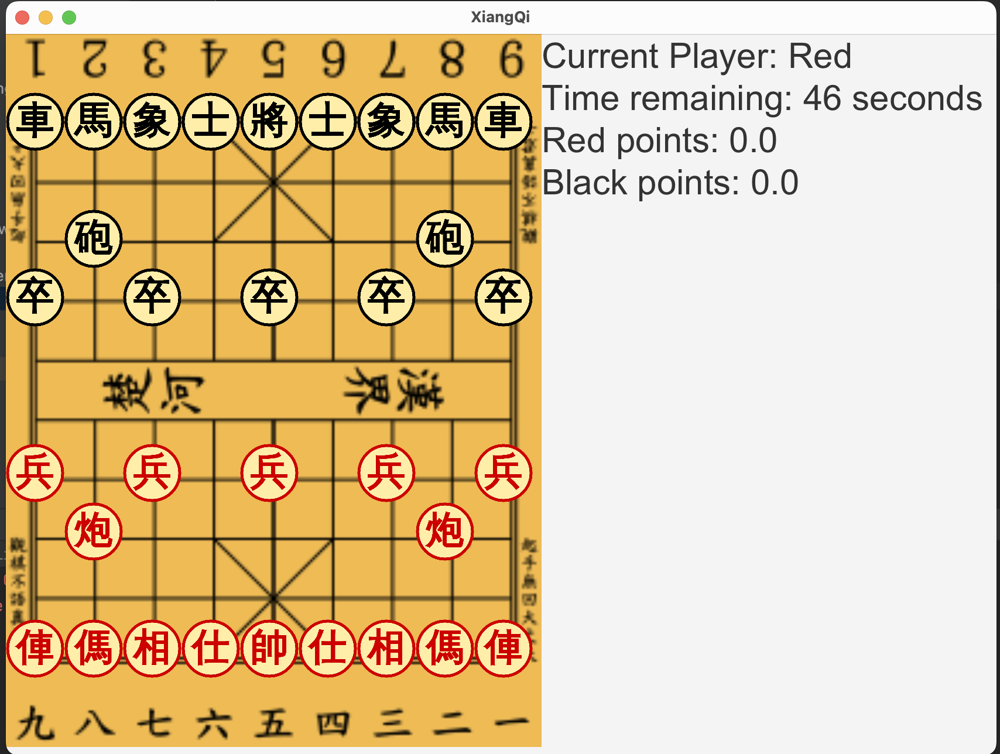
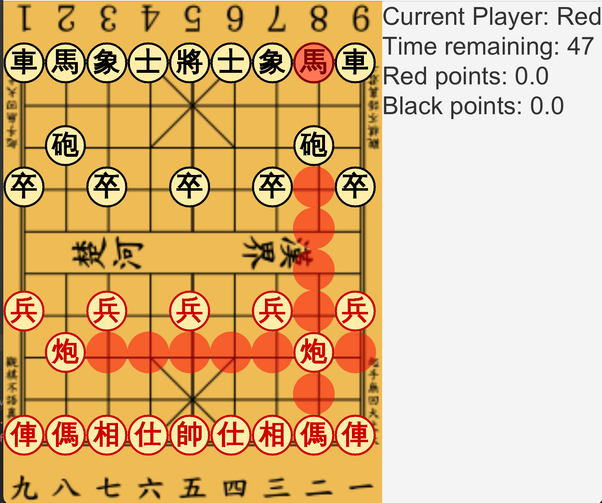

<h1>XIANG QI</h1>

<h2>Overview</h2>

This project is an implementation of Xiang Qi (Chinese Chess) using Java and JavaFX. It provides a graphical user interface for playing the game.

<h2>Pieces' Value</h2>

| PIECES   | POINTS | 
|----------|--------|
| Solider  | 1.0    |
| General  | 1000.0 |
| Elephant | 2.0    |
| Canon    | 4.5    |
| Chariot  | 9.0    |
| Advisor  | 2.0    |
| Horse    | 4.0    |

<h2>Features</h2>

- **Black Player vs Red Player Mode:** Enjoy engaging matches between two players.
- **Movement Guide:** Receive guidance on possible movements for each piece during gameplay.
- **General Piece Handling:** Implement specific logic for the General piece.
- **Time Measurement:** Keep track of the time spent by each player during the game.
- **Final Score Popup:** Display a pop-up message chart showcasing the final score and the victorious player.


<h2>Screenshots</h2>

**User interface**


**Gameplay with possible move**



<h2>Getting Started</h2>

- **Clone project repository in terminal:**
```
git clone https://github.com/RmitNeoculturetechclub/Xiang-Qi.git
```

- **Run file path (by hand):**
```
JavaFX/src/main/java/com/example/xiangqi/Game.java
```

<h2>Prerequisites</h2>

- Java >= 8
- JavaFX (included in Java SE 8 and 11)

<h2>Usage</h2>

- Use the mouse to interact with the game board.
- Moves are allowed only in corresponding player order (Red or Black).

